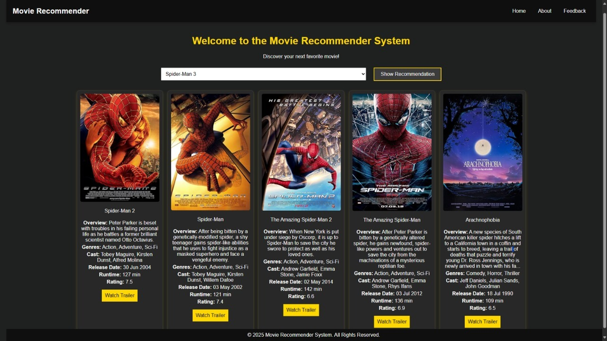
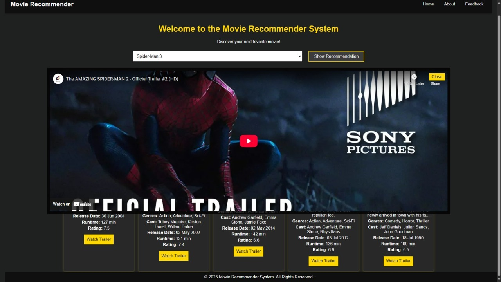
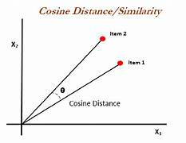

# 🎬 Movie Recommendation System

A **content-based movie recommender system** that suggests movies similar to the one selected by the user using **Machine Learning** techniques.

The system analyzes movie metadata such as genres, cast, keywords, and overview to compute similarity between movies and provide accurate recommendations.

This project integrates:

- 🎥 **YouTube API** for trailers
- 🖼️ **OMDB API** for movie posters and metadata
- 🧠 **Cosine Similarity + TF-IDF Vectorization**
- 🌐 **Flask Backend**
- 💻 **Interactive Frontend UI**

---

# 📌 Features

✅ Content-Based Filtering using similarity matrix  
✅ Machine Learning model built in Jupyter Notebook  
✅ Movie recommendations based on selected movie  
✅ Dynamic movie details display:

- Poster
- Overview
- Cast
- Genre
- Ratings
- Runtime
- Release Date

✅ Integrated movie trailer playback using YouTube  
✅ Interactive and responsive frontend UI  
✅ Hover effects and smooth UI interactions  
✅ Flask backend serving ML recommendations  

---

# 🛠️ Tech Stack

| Layer | Technologies |
|---|---|
| Data Science | Python, Pandas, NumPy, Scikit-learn |
| Machine Learning | TF-IDF Vectorizer, Cosine Similarity |
| Backend | Flask |
| Frontend | HTML, CSS, JavaScript |
| APIs | OMDB API, YouTube API |
| Development Tools | VS Code, Jupyter Notebook |

---

# 🧠 Machine Learning Approach

This project uses a **Content-Based Recommendation System**.

The recommendation engine compares movies based on:

- Genres
- Keywords
- Cast
- Crew
- Movie Overview

These features are merged into a single text representation and converted into vectors using **TF-IDF Vectorization**.

Then, **Cosine Similarity** is used to calculate how similar movies are to each other.

---

# 📐 Cosine Similarity

➡️ **Cosine Similarity** measures how similar two movies are based on the angle between their feature vectors.

If the angle between vectors is:

- **Small** → similarity close to **1** → movies are highly similar
- **Large** → similarity close to **0** → movies are different

## Formula

\[
\text{Cosine Similarity} =
\frac{A \cdot B}{||A|| \ ||B||}
\]

Where:

- \(A \cdot B\) = Dot Product of vectors
- \(||A||\) = Magnitude of vector A
- \(||B||\) = Magnitude of vector B

---

# ⚙️ Workflow

## 1️⃣ Data Collection

Movie metadata is collected from the TMDB dataset.

## 2️⃣ Data Cleaning

The dataset is cleaned and important features are extracted.

## 3️⃣ Feature Engineering

Relevant features are combined into tags:

- Genres
- Overview
- Keywords
- Cast
- Crew

## 4️⃣ Vectorization

TF-IDF converts text data into numerical vectors.

## 5️⃣ Similarity Calculation

Cosine similarity computes similarity scores between movies.

## 6️⃣ Model Storage

Processed data and similarity matrix are stored as:

- `movies_dict.pkl`
- `similarity.pkl`

## 7️⃣ Flask Backend

Flask loads the ML model and serves recommendations to the frontend.

## 8️⃣ Frontend Display

The UI dynamically displays:

- Recommended movies
- Posters
- Ratings
- Trailer player
- Movie details

---

# 🚀 How It Works

1. User selects or searches for a movie  
2. The system finds similar movies using cosine similarity  
3. Flask backend sends recommendation data  
4. OMDB API fetches posters and movie metadata  
5. YouTube API fetches movie trailers  
6. Recommended movies are displayed on the webpage  

---

# 🖼️ Project Screenshots

## 🔍 Search & Recommendation Page

The user searches for **Spider-Man 3**, and the system displays:

- 5 similar Spider-Man movie recommendations
- Posters
- Overview
- Cast
- Genre
- Ratings
- Runtime
- Release Date



---

## 🎥 Trailer Playback Section

When the trailer button is clicked, the trailer opens inside the website using an embedded YouTube player.



---

## 📊 Cosine Similarity Diagram

Visualization representing how cosine similarity works for comparing movie vectors.



---

# 📂 Project Structure

```bash
movie/
│
├── client/
├── image/
│   ├── movie1.jpg
│   ├── movie2.jpg
│   └── Cosine.jpg
│
├── static/
│   ├── css/
│   └── js/
│
├── templates/
│
├── app.py
├── movie_dict.pkl
├── movies.pkl
├── similarity.pkl
├── tmdb_5000_movies.csv
├── tmdb_5000_credits.csv
└── README.md
```

---

# 📦 Installation

## 1️⃣ Clone Repository

```bash
git clone https://github.com/your-username/movie.git
```

---

## 2️⃣ Navigate to Project Folder

```bash
cd movie
```

---

## 3️⃣ Install Dependencies

```bash
pip install -r requirements.txt
```

---

## 4️⃣ Run Flask Application

```bash
python app.py
```

---

## 5️⃣ Open Browser

```bash
http://127.0.0.1:5000/
```

---

# 🔑 API Configuration

## OMDB API

Used for:

- Movie posters
- Ratings
- Metadata

Get API Key:

👉 https://www.omdbapi.com/

---

## YouTube API

Used for:

- Movie trailers

Get API Key:

👉 https://console.cloud.google.com/

---

# 📈 Future Improvements

- Personalized recommendations
- User authentication system
- Watchlist feature
- Collaborative filtering
- Hybrid recommendation system
- Sentiment analysis on reviews
- Trending movie section
- Dark/Light mode
- Mobile optimization

---

# 💡 Learning Outcomes

Through this project, I learned:

- Machine Learning fundamentals
- Recommendation systems
- Feature engineering
- TF-IDF vectorization
- Cosine similarity
- Flask backend development
- API integration
- Frontend development
- Full-stack project integration

---

# 🙌 Acknowledgements

- TMDB Dataset
- OMDB API
- YouTube Data API
- Scikit-learn Documentation
- Flask Documentation

---

# 👩‍💻 Author

## Riya H. S. Pandey

Passionate about:

- Data Science
- Machine Learning
- Data Engineering
- Full Stack Development

---

# ⭐ If You Like This Project

Give it a ⭐ on GitHub!